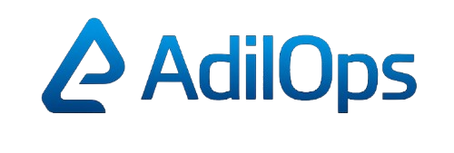

<div id="hero">
  <p align="center" dir="auto">
      <a>
        
      </a>
    </p>
    <p align="center" dir="auto">
      Modular logistics and supply chain operating system
      <br>
      <a href="https://docs.fleetbase.io/" rel="nofollow" target="_fleetbase_docs">Documentation</a>
      ·
      <a href="https://console.fleetbase.io" rel="nofollow" target="_fleetbase_console">Cloud Version</a>
      ·
    </p>
    <hr />
</div>

## What is AdilOps?

AdilOps is a Fleetbase of modular logistics and supply chain operating system designed to streamline management, planning, optimization, and operational control across various sectors of the supply chain industry.

<p align="center" dir="auto">
  
</p>

**Quickstart**

```bash
git clone git@github.com:Amber025/AdilOps.git
cd AdilOps && ./scripts/docker-install.sh
```

## 📖 Table of contents

  - [Features](#-features)
  - [Install](#-install)
  - [Extensions](#-extensions)
  - [Apps](#-apps)
  - [Roadmap](#-roadmap)
  - [Creators](#-creators)

## 📦 Features
- **Extensible:** Build installable extensions and additional functionality directly into the OS via modular architecture.
- **Developer Friendly:** RESTful API, socket, and webhooks to seamlessly integrate with external systems or develop custom applications.
- **Native Apps:** Collection of open-source and native apps designed for operations and customer facing.
- **Collaboration:** Dedicated chat and comments system for collaboration across your organization.
- **Security:** Secure data encryption, adherence to industry-standard security practices, and a comprehensive dynamic Identity and Access Management (IAM) system.  
- **Telematics:** Integrate and connect to hardware devices and sensors to provide more feedback and visibility into operations.
- **Internationalized:** Translate into multiple languages to accommodate diverse user bases and global operations.
- **Framework:** PHP core built around logistics and supply chain abstractions to streamline extension development.
- **Dynamic:** Configurable rules, flows and logic to enable automation and customization.
- **UI/UX:** Clean, responsive user-friendly interface for efficient management and operations from desktop or mobile.
- **Dashboards:** Create custom dashboards and widgets to get full visibility into operations.  
- **Scalability:** Uninterrupted growth with scalable infrastructure and design, capable of handling increasing data volume and user demand as your business expands.
- **Continuous Improvements:** Commitment to continuous improvement, providing regular updates that seamlessly introduce optimizations, new features, and overall enhancements to the OS.
- **Open Source:** Deploy it either on-premise or in the cloud according to your organization's needs and preferences.

## 💾 Install
Getting up and running with AdilOps via Docker is the quickest and most straightforward way. 
  
Make sure you have both the latest versions of docker and docker-compose installed on your system.

```bash
git clone git@github.com:Amber025/AdilOps.git
cd AdilOps && ./scripts/docker-install.sh
```

### Accessing AdilOps
Once successfully installed and running you can then access the AdilOps console on port 4200 and the API will be accessible from port 8000.  
  
AdilOps Console: http://localhost:4200
AdilOps API: http://localhost:8000

### Additional Configurations

**CORS:** If you’re installing directly on a server you will need to configure the environment variables to the application container:
```
CONSOLE_HOST=http://{yourhost}:4200
```
If you have additional applications or frontends you can use the environment variable `FRONTEND_HOSTS` to add a comma delimited list of additioal frontend hosts.

**Application Key** If you get an issue about a missing application key just run:
```bash
docker compose exec application bash -c "php artisan key:generate --show"
```
Next copy this value to the `APP_KEY` environment variable in the application container and restart.
  
**Routing:** AdilOps ships with a default OSRM server hosted by `[router.project-osrm.org](https://router.project-osrm.org)` but you’re able to use your own or any other OSRM compatible server. You can modify this in the `console/environments` directory by modifying the .env file of the environment you’re deploying and setting the `OSRM_HOST` to the OSRM server for Fleetbase to use.  
  
**Services:** There are a few environment variables which need to be set for AdilOps to function with full features. If you’re deploying with docker then it’s easiest to just create a `docker-compose.override.yml` and supply the environment variables in this file.

```yaml
version: “3.8”
services:  
  application:  
    environment:  
      CONSOLE_HOST: http://localhost:4200
      MAIL_MAILER: (ses, smtp, mailgun, postmark, sendgrid)
      OSRM_HOST: https://router.project-osrm.org
      IPINFO_API_KEY:
      GOOGLE_MAPS_API_KEY:  
      GOOGLE_MAPS_LOCALE: us
      TWILIO_SID:  
      TWILIO_TOKEN:
      TWILIO_FROM:
```

# 🧩 Extensions 

Extensions are modular components that enhance the functionality of your AdilOps instance. They allow you to add new features, customize existing behavior, or integrate with external systems.

## ⌨️ AdilOps CLI 

The AdilOps CLI is a powerful tool designed to simplify the management of extensions for your AdilOps instance. With the CLI, you can effortlessly handle authentication, install and uninstall extensions, and scaffold new extensions if you are developing your own.

Get started with the CLI with npm:

```bash
npm i -g @adilops/cli
```

Once installed, you can access a variety of commands to manage your AdilOps extensions.

# 📱 Apps

AdilOps is looking to offer a few open sourced apps which are built on Fleetbase which can be cloned and customized. Every app is built so that the Fleetbase instance can be switched out whether on-premise install or cloud hosted.

<ul>
  <li><a href="https://github.com/fleetbase/storefront-app">Storefront App</a>: AdilOps based ecommerce/on-demand app for launching your very own shop or marketplace to Apple or Android playstore.</li>
  <li><a href="https://github.com/fleetbase/navigator-app">Navigator App</a>: AdilOps based driver app which can be used for drivers to manage and update order, additionally provides real time driver location which can be viewed in the AdilOps Console.</li>
</ul>

## 🛣️ Roadmap
1.  **Inventory and Warehouse Management** ~ Pallet will be AdilOps' first official extension for WMS & Inventory.
2.  **Accounting and Invoicing** ~ Ledger will be AdilOps' first official extension accounting and invoicing.
3.  **AdilOps for Desktop** ~ Desktop builds for OSX and Windows.
4. **Custom Maps and Routing Engines** ~ Feature to enable easy integrations with custom maps and routing engines like Google Maps or Mapbox etc…


## Creators

<p dir="auto"><strong>Aadil Shani Akhtar</strong>- IEM @ RVCE</p>
          
<p><a href="https://github.com/Aadil-SA22">Github</a> | <a href="https://www.linkedin.com/feed/">LinkedIn</a></p>
                   

